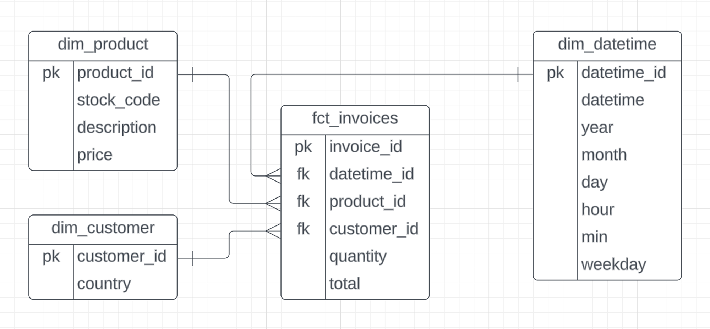

# Online-Retail-airflow

### Project Pipeline

### Project Overview
This project is aims on using astronomer for doing some ETL pipeline astronomer tool for using airflow and dbt 

### Services on Google cloud Platform
1. Google Cloud Storage(GCS): use for storing our dataset
2. Bigquery: use for doing SQL execution

### Data Model

using dbt for transforimg data into the schema above 

### Dash Board

using metabase for making dash board
